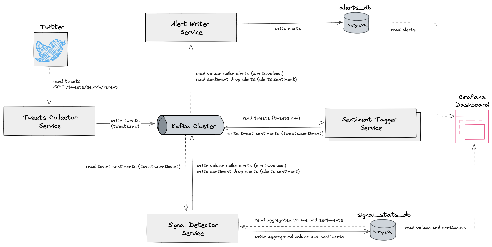

# Real Time Tweet Sentiment Monitoring System

Real-time microservices system that detects sudden changes in tweet volume and sentiment for any keyword, hashtag, or
ticker.



## Tech Stack

- **Java + Spring Boot** – Microservices backend
- **Apache Kafka** – Event streaming and decoupled communication
- **PostgreSQL** – Persistent storage for alerts and metrics
- **Docker Compose** – Local orchestration of the full stack
- **Grafana** – Real-time dashboards
- **AKHQ** – Kafka topic browser for observability

## Services Breakdown

### Tweets Collector Service

Fetches tweets in real-time using the Twitter API (prod mode) or a mock tweet generator (local mode).
It is the system’s data ingestion point.
Tweets are published to the Kafka topic `tweets.raw` for downstream processing.
Exposes a debug port (58000) for live inspection.

#### Configuration Highlights

Defined in `application.yml`:

- `twitter.api.bearer-token`: Twitter API token (inject via env)
- `twitter.query.monitored-topics`: Map of topics and keywords
- `twitter.poll.interval-seconds`: Polling frequency

#### Example Output to `tweets.raw`

```json
{
  "id": "1947707000000000005",
  "text": "Interest rates have remained unchanged...",
  "lang": "en",
  "created_at": "2025-08-02T10:39:20Z",
  "country_code": "US",
  "matched_topics": [
    "Inflation"
  ],
  "matched_keywords": [
    "interest rates"
  ]
}
```

#### Local Development (Default)

No configuration is needed.  
When running locally or via Docker Compose, the `local` profile is active by default.

- Uses a mocked tweet source
- Sends fake tweet data to `tweets.raw`
- Ideal for development and debugging

#### Running with Real Twitter API (`prod` profile)

To use real-time tweets from Twitter, run the service with the `prod` profile.
You must update the config inside application-prod.yml including kafka servers, `bearer-token` and topics to monitor.

#### Tech Stack

- Language: Java 21
- Framework: Spring Boot 3.5.x
- Build tool: Maven

### Sentiment Tagger Service (not implemented yet)

Classifies incoming tweets by sentiment (e.g., positive, negative, neutral) and publishes them to a dedicated Kafka
topic for analysis.
Consumes tweets from `tweets.raw`, output is sent to `tweets.sentiment`.

### Signal Detector Service (not implemented yet)

Analyzes tweet activity over time to detect anomalies in volume or sentiment.
It triggers alerts and stores metrics to support monitoring and visualization.
Reads from `tweets.sentiment` and writes to `alerts.volume`, `alerts.sentiment`, `signal_stats_db`

### Alert Writer Service (not implemented yet)

Consumes alerts and writes them to a PostgreSQL database for long-term storage and integration with monitoring tools
like Grafana.
Reads from `alerts.volume`, `alerts.sentiment`, writes to `alerts_db` to store alert data for querying and dashboard
visualization.

## Local Development & Debug

To run the system locally with a mocked Twitter API and full Kafka infrastructure:

### 1. Start the system

```bash
cd docker
docker compose up --build
```

This starts:

- Kafka cluster with **3 controllers** and **3 brokers**
- AKHQ UI at [http://localhost:8080](http://localhost:8080)
- Tweets Collector Service in `local` mode (mock data)
- Predefined Kafka topics via `init-topics` script

### 2. Debugging the Tweets Collector

The `tweets-collector` service is configured for remote debugging:

- **Debug port:** `5005` (exposed on `localhost:58000`)
- **Attach configuration (e.g. IntelliJ):**
  - Host: `localhost`
  - Port: `58000`

Ensure you have `ENABLE_DEBUG=true` and `DEBUG_PORT=5005` set in the environment variables (already configured
in `docker-compose.yml`).

### 3. Kafka Observability

Use **AKHQ** to inspect topics and partitions:

- 📍 http://localhost:8080/ui
- Brokers: `broker1`, `broker2`, `broker3`
- Topics (auto-created): `tweets.raw`, `tweets.sentiment`, `alerts.volume`, `alerts.sentiment`
